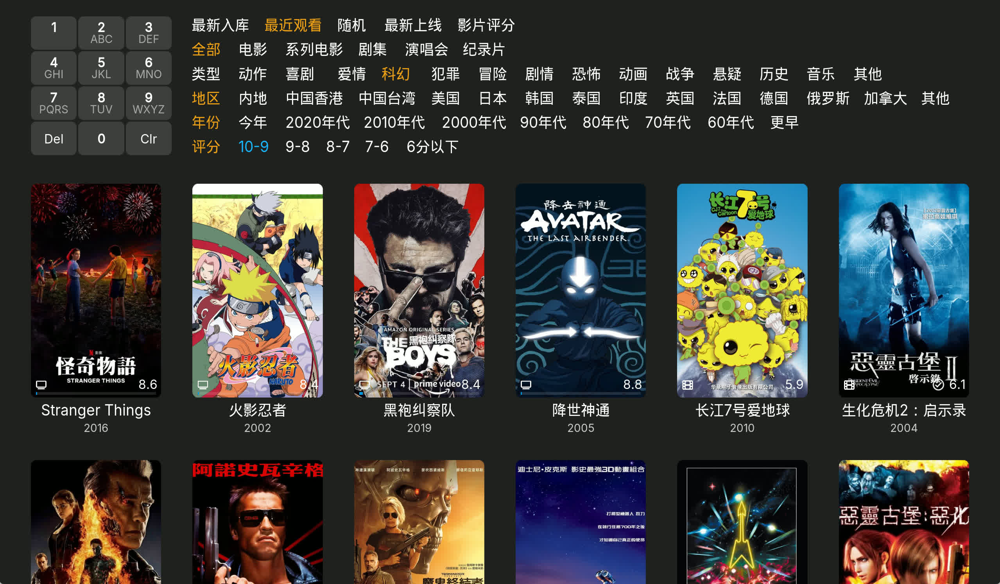

# Kodi 电影剧集筛选插件

**圆角皮肤适配(地平线2，导火线2等)**


**方角皮肤适配**


这是一个为 Kodi 设计的高级电影剧集筛选和增强工具插件。

## 功能介绍

### 通用功能 (任意皮肤可用)

1.  **完整筛选页面实现**
    *   提供类似爱优腾、爆米花等流媒体平台的筛选体验。
    *   支持按类型、地区、年份、评分等多维度筛选。
    *   为地平线、导火线、清风皮肤适配了圆角。

2.  **九宫格输入法筛选电影**
    *   支持使用遥控器数字键直接输入拼音进行筛选 (T9输入法)。
    *   快速定位电影，无需繁琐的软键盘输入。

3.  **一键快捷接口**
    *   **一键字幕**: 快速切换或选择字幕。
    *   **一键音轨**: 快速切换音频轨道。
    *   **一键倍速**: 快速调整播放速度(CE下不可用)。

4.  **剧集跳过片头片尾**
    *   支持手动记录剧集的片头和片尾时间点(一季记录一次)。
    *   自动跳过已记录的片头和片尾，实现无缝追剧体验。

### Estuary 皮肤专属功能

1.  **自定义全局背景**
    *   在电影列表右键菜单中，可将任意电影的艺术图（Fanart）设置为 Kodi 的常驻全局背景图案。

---

## 接口调用

可以通过 `RunScript` 命令调用本插件提供的接口功能。  
可以绑定到遥控按键或者皮肤视图


## 使用示例

### 1. 绑定到遥控器按键 (Keymap)
编辑 `userdata/keymaps/gen.xml` (或新建)，将功能绑定到特定按键。

**示例：绑定启动筛选页面 (红色键) 及跳过功能 (蓝色键)**
```xml
<keymap>
  <Global>
    <keyboard>
      <!-- 芝杜V12红色键 (ID 61952): 启动筛选页面 -->
      <key id="61952">RunScript(plugin.video.filteredmovies, 0, ?mode=launch_t9)</key>
    </keyboard>
  </Global>
  <!-- FullscreenVideo: 全屏播放视频时生效 (无菜单遮挡) -->
  <FullscreenVideo>
    <keyboard>
      <!-- 蓝色键短按: 记录片头或片尾的时间点 -->
      <key id="61514">RunScript(plugin.video.filteredmovies, ?mode=record_skip_point)</key>
      <!-- 蓝色键长按: 删除片头或片尾的时间点 -->
      <key id="61514" mod="longpress">RunScript(plugin.video.filteredmovies, ?mode=delete_skip_point)</key>
    </keyboard>
  </FullscreenVideo>
  <!-- VideoOSD: 当呼出播放进度条/菜单时生效 (建议与 FullscreenVideo 保持一致) -->
  <VideoOSD>
    <keyboard>
      <key id="61514">RunScript(plugin.video.filteredmovies, ?mode=record_skip_point)</key>
      <key id="61514" mod="longpress">RunScript(plugin.video.filteredmovies, ?mode=delete_skip_point)</key>
    </keyboard>
  </VideoOSD>
</keymap>
```


### 2. 在皮肤视图中调用 (Skin XML)
在皮肤文件的控件事件中调用，例如在某个按钮被点击时触发。

**示例：点击按钮启动 T9 搜索界面**
```xml
<control type="button" id="9000">
    <onclick>RunScript(plugin.video.filteredmovies, ?mode=launch_t9)</onclick>
    <label>搜索</label>
</control>
```

**示例：点击按钮切换字幕**
```xml
<control type="button" id="5001">
    <onclick>RunScript(plugin.video.filteredmovies, ?mode=select_subtitle)</onclick>
    <label>切换字幕</label>
</control>
```
### 1. 打开筛选/T9搜索页面
```xml
RunScript(plugin.video.filteredmovies, ?mode=launch_t9)
```
### 2. 播放控制接口
**一键选择字幕**
```xml
RunScript(plugin.video.filteredmovies, ?mode=select_subtitle)
```

**一键选择音轨**
```xml
RunScript(plugin.video.filteredmovies, ?mode=select_audio)
```

**一键选择倍速**
```xml
RunScript(plugin.video.filteredmovies, ?mode=select_playback_speed)
```

### 3. 跳过片头片尾接口
**记录当前时间为跳过点 (片头/片尾)**
*   在剧集播放的前20%调用记录为片头结束点。
*   在剧集播放的后20%调用记录为片尾开始点。
```xml
RunScript(plugin.video.filteredmovies, ?mode=record_skip_point)
```

**删除当前剧集的跳过点记录**
```xml
RunScript(plugin.video.filteredmovies, ?mode=delete_skip_point)
```

### 4. 其他实用接口
**打开当前播放剧集的列表**
```xml
RunScript(plugin.video.filteredmovies, ?mode=open_playing_tvshow)
```

